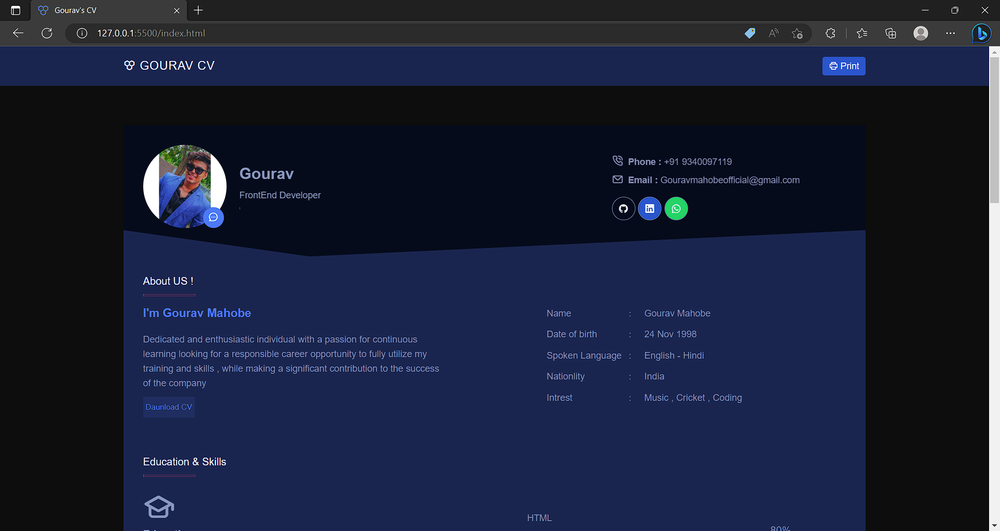

# Portfolio

This is a simple HTML CV, created by Gourav Mahobe.

## Table of Contents

---

- [Introduction](#introduction)
- [NavBar](#navbar)
- [Main](#main)
  - [Profile Section](#profile-section)
  - [About Section](#about-section)
  - [Skills Section](#skills-section)
- [License](#license)

## Introduction

This HTML CV is created by Gourav Mahobe. It contains information about Gourav's profile, skills, education, and interests.

## NavBar

---

The NavBar contains a logo and a button to print the CV. The logo is an icon of a cell and the text "GOURAV CV". The button has an icon of a printer and the text "Print".

## Main

---

The main section contains three sections: Profile, About, and Skills.

### Profile Section

The Profile section contains Gourav's photo, name, and title. The title is presented in a rotating text format, with two possible titles: "FrontEnd Developer" and "UI/UX Designer". Additionally, this section contains Gourav's phone number, email, and links to his GitHub, LinkedIn, and WhatsApp profiles.

### About Section

The About section contains information about Gourav, including his name, date of birth, spoken languages, nationality, and interests. This section also contains a brief description of Gourav's professional aspirations, accompanied by a button to download his CV.

### Skills Section

The Skills section contains information about Gourav's education and skills. The education information is presented in a timeline format, with the name of the institution, the degree, and the dates of attendance. The skills are presented in a bullet point list.

Github gnerated page url: https://sachin12031999.github.io/NYIF-Capital_Market_Professional/

## clone  this GitHub repository

- Open a terminal or Git Bash window on your local machine
- type ''' git clone https://github.com/username/repository '''

## Screenshorts

Contributing
Contributions are welcome. For major changes, please open an issue first to discuss what you would like to change.